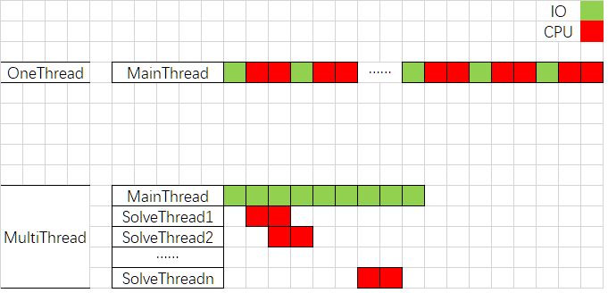
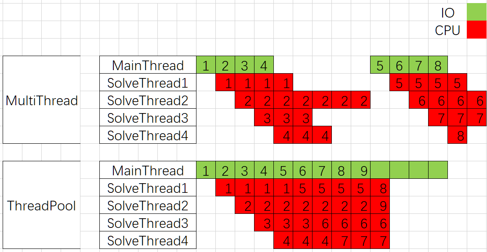
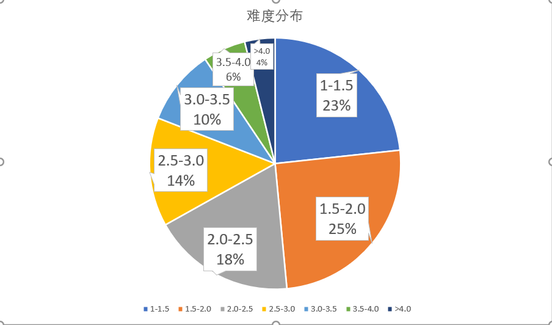
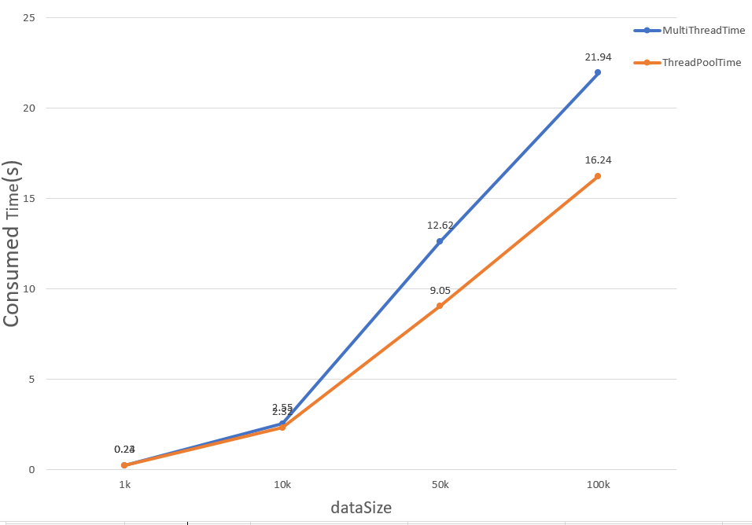

# Lab1 test report

## 1. 实验概要

&emsp;&emsp;多线程编程是高性能编程的技术之一，实验1将针对数独求解问题比较单线程、一般多线程、线程池的性能差异以及多线程在不同硬件环境下的性能差异。

### 1.1 程序输入

&emsp;&emsp;程序将在控制台接收用户输入，该输入应为某一目录下的一个数独谜题文件，该文件包含多个数独谜题，每个数独谜题按固定格式存储在该文件中。

### 1.2 程序输出

&emsp;&emsp;实验中把数独的解按与输入相对应的顺序写入到一个文件中。

### 1.3 Sudoku算法

&emsp;&emsp;实验共提供了4中不同的Sudoku求解算法：BASIC,DANCE,MINA和MINAC。其中，DANCE算法速度最快，BASIC算法速度最慢。实验中选用的是最快的DANCE舞蹈链算法。

### 1.4 性能指标

&emsp;&emsp;实验以求解完单个输入文件里的所有数独题并把数独的解按顺序写入文件所需要的时间开销作为性能指标。一般而言，可以用加速比直观地表示并行程序与串行程序之间的性能差异（加速比：串行执行时间与并行执行时间的比率，是串行与并行执行时间之间一个具体的比较指标）。

### 1.5 实验环境

&emsp;&emsp;实验中共有2个不同的实验环境：**ENV1**和**ENV2**。

&emsp;&emsp;**ENV1:** linux内核版本为；GB内存；CPU型号为，共有个物理CPU；每个物理CPU有个物理核心，共有个物理核心；不使用超线程技术。

&emsp;&emsp;**ENV2:** linux内核版本为；GB内存；CPU型号为，共个物理CPU；每个物理CPU有个物理核心，共有个物理核心；不使用超线程技术。

如无特别说明，默认使用ENV。

### 1.6 代码实现版本

&emsp;&emsp;实验中共使用三份不同的代码：**Code1**、**Code2**、**Code3**。

&emsp;&emsp;**Code1:** 原生的数独求解代码，以单线程模式运行。

&emsp;&emsp;**Code2:** 动态创建多线程求解数独问题

&emsp;&emsp;**Code3:** 初始化线程池，线程池求解数独问题，避免了Code2中额外的创建、销毁代价

## 2. 性能测试

&emsp;&emsp;程序的性能会受到诸多因素的影响，其中包括软件层面的因素和硬件层面的因素。本节将分析比较多线程程序与单线程程序的性能差异、同一功能不同代码实现的性能差异，以及同一个程序在不同硬件环境下的性能差异。

### 2.1 多线程与单线程性能比较

&emsp;&emsp;单线程程序只能利用1个CPU核心，而多线程程序可以最大限度地利用CPU资源。当总线程数不大于CPU核心数时，多线程程序的性能随着总线程数的增加而提升；随着总线程数的继续增加，总线程数超过CPU核心数，程序的性能反而有所下降。

&emsp;&emsp;实验提供1个大小为7.8 MB、具有100K个数独题的文件，对多线程与单线程性能比较。两个程序分别创建单个线程和n个线程求解数独问题，求出多次运行的平均时间开销与相应的加速比，比较单线程与多线程、创建不同线程数的多线程程序的性能。

&emsp;&emsp;图2-1展示了不同线程数对性能造成的影响，其2条折线：**Consumed time**和**Speedup**分别表示随sodoku_solve线程数量的变化所需的时间开销和相应的加速比。从图2-1中可以看出，当多线程程序创建的总线程数不大于CPU物理核心数（测试环境为4个）时，随着总线程数的增加，时间开销不断减小、加速比不断增加。单线程程序只有一个主线程，在读取puzzle文件时线程阻塞，造成CPU闲置，总时间开销$T_{Sum}=T_{IO}+T_{OneSolve}$，其过程如图2-2所示；多线程程序一方面充分的利用多个CPU并行求解问题，近似的有$T_{MultiSolve}=\large\frac {T_{OneSolve}}{n}$，另一方面主线程读取puzzle文件被阻塞时，其所创建的sodoku_solve子线程可以使用主线程让出的CPU资源进行问题求解，如图2-2所示，该过程以流水线模式进行IO和CPU计算，近似的有$T_{IO}=0$。图2-2中的时间消耗曲线验证了这一分析，当线程数目$thread num\in[1,4]$时，随着线程数目的增加$T_{sum}$不断下降，且符合$T_{MultiSolve}=\large\frac {T_{OneSolve}}{n}$。而当线程数目继续增加超过CPU物理核心数时性能急剧下降，加速比几乎稳定在了2.0附近。这是因为sodoku_solve线程数超过了CPU物理核心数，至少有两个线程在同一个CPU上运行，当一个线程的时间片消耗后就会进行CPU调度，而频繁的上下文切换带来较大额外时间开销，引起性能下降。

**
图2-1 多线程程序运行时间、加速比随线程数变化曲线
**

**
图2-2 单线程与多线程IO和CPU时间片
**

### 2.2 线程池优化

&emsp;在2.1中的多线程测试代码中，已经完成的线程需要等待最后完成的线程才可以进行下一批次的问题求解，在上述测试中所用puzzle数据集中的题目难度相差不大，每个任务所用的时间相近。因此可以近似的认为$T_{MultiSolve}=\large\frac {T_{OneSolve}}{n}$。但当puzzle数据集中的题目难度分布差异较大时，动态创建多线程的程序代码性能就会受到每一批次**最后完成的线程**的限制，比较极端的一种情况如图2-3所示，图中时间片上的数字表示的是某一个puzzle的读取、求解。从图中可以看到，动态创建的多线程代码在求解第一批次的1号到4号问题时，2号线程是最后完成的线程，主线程与其他三个sodoku_solve线程需要等待，造成资源大量闲置。而使用线程池技术后，主线程不断读取新的puzzle，并将任务分发给当前线程池中空闲的线程，CPU时间片变得非常紧凑，大大提高了CPU利用率。

&emsp;在实验中，为了模拟这样的一种情况，我们从一个500M大小带有难度评价标签的数据集中生成了一系列如图2-4所示的难度分布的数据集，puzzle数目分别为1k、10k、50k、100k。饼状图中的数字越大对应的puzzle难度越高，求解时间相对更长。实验结果如图2-5所示，在“精心设计”的数据集下，随着数据规模的不断增加，线程池技术的优化效果越发明显。通过重复利用已创建的线程降低线程创建和销毁造成的消耗的同时，可以不需要等待线程创建就能立即执行主线程分配的新任务，验证了之前对动态创建的多线程代码缺点的分析。

**
图2-3 单线程与多线程IO和CPU时间片
**

**
图2-4 生成的puzzle数据集难度分布
**

**
图2-5 普通多线程与线程池时间消耗对比
**

### 2.3 不同硬件环境性能比较
