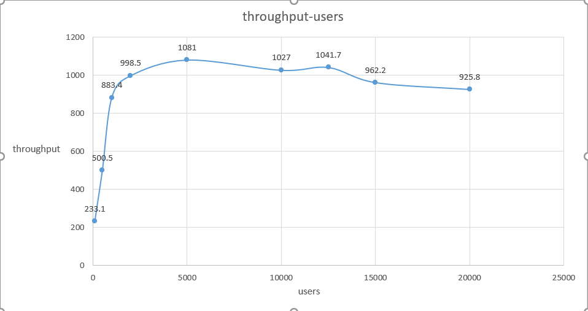

##### Lab2 test report

## 1. 实验概要

&emsp;&emsp;使用从课程中学到的网络编程知识，实现一个基于HTTP/1.1的HTTP服务器，尽量使用从课程中学到的高并发性编程技巧来保证web服务器的性能。实验2将比较不同并发请求用户数的性能差异、不同客户端负载的性能差异以及在不同硬件环境下的性能差异。

### 1.1 程序输入

&emsp;&emsp;通过命令行输入长选项--port 与 --number-thread 的值，以HTTP运行服务器程序。之后可通过浏览器、curl、ab、JMETER等测试工具对服务器的性能进行测试

### 1.2 程序输出

&emsp;&emsp;对于请求资源存在的GET请求报文，将返回包含所请求资源的响应报文。对于符合实验指导书中格式的POST请求，将返回包含回显信息的响应报文。

### 1.3 性能指标

&emsp;&emsp;实验以服务器每秒钟处理的http请求数作为性能指标。更具体的是通过测量每秒点击率(Hits Per Second)来量化服务器性能。

&emsp;&emsp;点击率是每秒钟用户向WEB服务器提交的HTTP请求数.这个指标是WEB应用特有的一个指标:WEB应用是"请求-响应"模式,用户发出一次申请,服务器就要处理一次,所以点击是WEB应用能够处理的交易的最小单位

### 1.4 实验环境

&emsp;&emsp;实验中共有2个不同的实验环境：**ENV1**和**ENV2**。

&emsp;&emsp;**ENV1:** linux内核版本为4.15.0-129-generic；2GB内存；CPU型号为Intel(R) Core(TM) i5-7300HQ CPU @ 2.50GHz，共有2个物理CPU；每个物理CPU有1个物理核心，共有2个物理核心；不使用超线程技术。

&emsp;&emsp;**ENV2:** linux内核版本为4.15.0-129-generic；2GB内存；CPU型号为Intel(R) Core(TM) i5-7300HQ CPU @ 2.50GHz，共有4个物理CPU；每个物理CPU有1个物理核心，共有4个物理核心；不使用超线程技术。

如无特别说明，默认使用ENV2。

### 1.5 代码实现版本

&emsp;&emsp;实验中共使用两份不同的代码：**Code1**和**Code2**。

&emsp;&emsp;**Code1:** 动态创建线程（On-demand threads）。 每监听到一个新的客户连接就创建一个新线程，并使用该线程来处理客户请求的所有任务，包括解析HTTP请求、获取页面文件和发送响应。线程在客户端完成后销毁，通过Connection.READ()检测。

&emsp;&emsp;**Code2:** 线程池（A pool of always-on threads）。在HTTP服务器程序中使用固定大小的线程池来并发处理多个客户机请求。如果没有任务，则这些线程处于等待状态。如果有一个新客户端进入，分配一个线程来处理客户端请求并向它发送响应。

&emsp;&emsp;如无特别说明，默认使用Code2。

## 2. 性能测试

&emsp;&emsp;程序的性能会受到诸多因素的影响，其中包括软件层面的因素和硬件层面的因素。对于http服务器，客户端、CPU和网络带宽等都可能成为性能瓶颈。本节将分析比较不同并发请求用户数的性能差异、不同客户端负载的性能差异以及在不同硬件环境下的性能差异。

### 2.1 不同并发用户数的性能比较

&emsp;「TPS 」Transactions Per Second 也就是事务数/秒。一个事务是指一个客户机向服务器发送请求然后服务器做出反应的过程。客户机在发送请求时开始计时，收到服务器响应后结束计时，以此来计算使用的时间和完成的事务个数，并发数（并发度）：指系统同时能处理的请求数量，反应了系统的负载能力。「吐吞量」：吞吐量是指系统在单位时间内处理请求的数量，TPS是吞吐量的常用量化指标。其中，TPS=并发数/平均响应时间。一个系统吞吐量通常由TPS,并发数两个主要因素决定，每套系统这个两个值都有一个相对极限值，在应用场景访问压力下，只要某一项达到系统最高值，系统吞吐量就上不去了，如果压力继续增大，系统的吞吐量反而会下降，原因是系统超负荷工作，上下文切换，内存等等其他消耗导致系统性能下降。

&emsp;测试环境：硬件环境使用env2，本次测试改变不同的并发用户数（100-10000），并保证每个用户只发送一次请求，但是短时间内可以有大量用户同时发送请求，模拟了短时间内有大量用户同时访问服务器的情形。

&emsp;实验现象：可以看到，随着并发用户数的提升，吞吐率一开始持续增长，然后逐渐稳定（大约5000开始），最后当达到一定并发负荷时，继续增多用户数（大约15000开始），吞吐量有小幅下降。

**
图2-1 不同并发用户数的性能比较
**

### 2.2 不同客户端负载性能比较

&emsp;&emsp;测试对比客户端为新请求使用新的TCP连接（短连接）以及客户端为新请求重用旧TCP连接（长连接）两种工作负载的服务器性能。长连接是客户端与服务器先建立连接，连接建立后不断开，然后再进行报文发送和接收。短连接则是客户端与服务器每进行一次报文收发才建立连接，收发完毕后立即断开连接。长连接多用于操作频繁，而且连接数不太多的情况。每个TCP连接都需要三次握手，这需要时间，如果每个操作都是先连接，再操作的话那么处理速度会降低很多，所以每个操作完后不断开，下次就可以直接发送数据包，不用再建立TCP连接，减小了连接建立带来的开销。

&emsp;&emsp;实验中使用 JMETER 测试工具模拟少并发用户数、多次请求的客户端负载情形。通过参数设置，JMETER 会在1s内启动500个并发用户线程，每个用户线程发送num（num的测试序列为[1,10,15,25,50,100,300,900,1500]）次GET请求，并测试点击率。

&emsp;&emsp;图2-2显示了在少量并发用户数、每个用户都频繁进行请求的工作负载下，服务器与客户端分别建立长连接、短连接时的点击率测试结果，其中每个客户端线程请求数不断增加。当每个客户端线程请求数小于**某公共数值1**时，使用长连接和短连接的服务器的点击率都快速上升，该阶段是客户端成为服务器性能瓶颈，客户端发出的请求数较少，服务器的处理能力完全可以满足。当客户端线程请求数处于**数值2**和**数值3**之间时，使用长连接的服务器程序点击率仍在快速上升而使用短连接的服务器程序点击率趋于平稳，这是因为每个TCP连接建立都需要三次握手、断开连接需要四次挥手，使用长连接相比于使用短连接的服务器程序，节省了大量的TCP连接建立、拆除的时间开销。

**
图2-2 不同客户端负载性能比较
**

### 2.3 不同硬件环境性能比较

&emsp;&emsp;硬件环境如CPU主频、物理核心数等的不同，会导致同一个程序在不同的硬件环境中有不同的表现。对单个CPU物理核心，CPU主频即CPU的时钟频率，计算机的操作在时钟信号的控制下分步执行，每个时钟信号周期完成一步操作，时钟频率的高低在很大程度上反映了CPU速度的快慢。对单个CPU物理核心，其主频越高，运行速度越快。CPU核心数则决定了可以同时运行几个线程。

&emsp;&emsp;实验将使用线程池优化后的Code3分别在ENV1和ENV2中对大小为811KB、具有10k个数独题的文件进行求解，其中sudoku_solve线程数从1开始逐步增加，测量时间开销。

&emsp;&emsp;图2-6为Code3在不同的硬件环境ENV1和ENV2中分别调整不同的sudoku_solve线程数的测试结果。当总线程数为1\~2时，ENV1和ENV2环境下的代码性能相差无几，因为二者的CPU主频均为2.5GHZ，而对于单个CPU物理核心而言，其主频确定了运行速度的快慢。当总线程数为2\~4时，ENV1环境下创建的线程数超过其物理核心数，将有多个工作线程在同一个CPU上调度，带来了额外的上下文切换开销，此时ENV2环境下增加线程可以继续提高并行性能。当总线程数大于4时，ENV2环境下代码也因为创建的线程数超过其物理核心数，付出了许多的上下文切换开销，性能下降。

**
图2-3 不同硬件环境时间开销对比
**